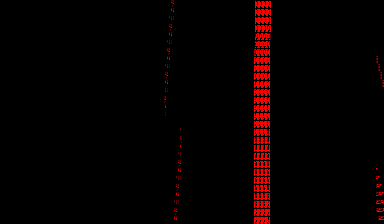

# vb-galacticpinball

**Static recompilation of Galactic Pinball (Virtual Boy, 1995)**



A launch title pinball game with four themed tables, scrolling space backdrops, and one of the better soundtracks on the system. Galactic Pinball leans heavily on the Virtual Boy's parallax depth, affine background transforms, and the VSU (sound unit) — a different stress profile than the project's other targets.

This project uses [vbrecomp](https://github.com/sp00nznet/vbrecomp) to statically recompile Galactic Pinball into a native executable.

## Why Galactic Pinball?

It's the third target after [Mario's Tennis](https://github.com/sp00nznet/vb-mariotennis) and [Red Alarm](https://github.com/sp00nznet/vb-redalarm), and it exercises parts of the system the first two don't:

- **VSU / audio** — pinball is wall-to-wall sound effects and music, much heavier than tennis or Red Alarm
- **Affine BG transforms** — angled playfield uses BG affine modes (different from tennis's sprite affine and Red Alarm's wireframe math)
- **Real-time physics** — ball/flipper interactions hammer the recompiled CPU loop continuously
- **Small ROM (1MB)** — fast recompile turnaround for iteration

## Current Status

| Stage | Status |
|-------|--------|
| Project scaffolded | Done |
| ROM recompiled (v810recomp) | Done — 598 funcs, ~24K lines C |
| Builds and links | Done |
| Reset vector executes | Done |
| Interrupt handlers wired | Done — Timer (07F00026), VIP (07F3FF48) |
| VIP interrupt loop firing | Done — INTENB enable→ack→clear cycle observed |
| Per-frame dispatcher running | Done — main.c reads [GP-0xCE3C] dynamically and dispatches |
| Inline-data-after-JAL helper handled | Done — `skip 0x07F417B8 0x8` hint, recomp side updated |
| CHR tiles being written | Done — varies per frame (24 to 1016+), real game state advancing |
| BGMap populated / pixels rendered | Done — first pixels at frame ~330, segment 13 |
| State machine progression | Boots through 4 states (07F5168C → 07F519B8 → 07F519D8 → 07F51A08) |
| Recognizable logo / title | In progress — first content visible but not yet a full logo |
| Boots to logo | Pending |
| Title screen | Pending |
| Table select | Pending |
| In-game | Pending |

### Known dispatcher hints

Galactic Pinball uses function pointers stored in WRAM for top-level
dispatch. The static analyzer can't propagate constants through memory,
so we hint the resolution in `Galactic Pinball (Japan, USA).hints.txt`:

```
jmp 0x07F42CDC 0x07F42D44   # state-init dispatch via [GP-0xCE34]
jmp 0x07F42F74 0x07F5168C   # per-frame dispatch via [GP-0xCE3C]
entry 0x07F519D8            # additional per-frame state handlers
entry 0x07F519B8
entry 0x07F51A08
skip 0x07F417B8 0x8         # graphics decompressor reads 8 bytes after JAL
```

More dispatches likely surface as we drive the game further. Add
entries to the hints file and re-run v810recomp.

## Building

Requires [vbrecomp](https://github.com/sp00nznet/vbrecomp) checked out as a sibling directory, plus SDL2 and Dear ImGui.

```bash
# Recompile the ROM (run once, or whenever v810recomp changes / hints change)
../vbrecomp/build/Debug/v810recomp.exe "Galactic Pinball (Japan, USA).vb" generated \
    --hints "Galactic Pinball (Japan, USA).hints.txt"

# Build the executable
cmake -B build -G "Visual Studio 17 2022" -DSDL2_DIR=C:/vcpkg/installed/x64-windows/share/sdl2
cmake --build build --config Debug
```

You'll need the original ROM file (`Galactic Pinball (Japan, USA).vb`) — not redistributed in this repo.

## Project Structure

```
├── src/main.c              # Entry point and game-specific HLE hooks
├── generated/
│   ├── recomp_funcs.c      # Recompiled V810 -> C (auto-generated, gitignored if large)
│   └── recomp_funcs.h      # Function declarations
├── screenshots/            # Development progress screenshots
├── CMakeLists.txt          # Build configuration
└── build/                  # Build artifacts
```

## License

MIT
