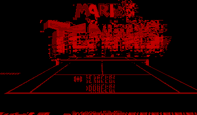
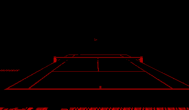
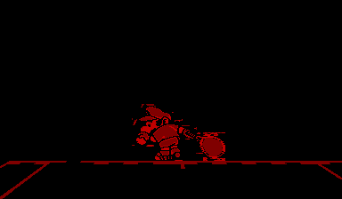

# vb-mariotennis

**Static recompilation of Mario's Tennis (Virtual Boy, 1995)**

The pack-in title that shipped with every Virtual Boy. Mario plays tennis. In red. In 3D. It was actually pretty fun — and it's the reason we're building [vbrecomp](https://github.com/sp00nznet/vbrecomp) in the first place.



## About the Game

Mario's Tennis was the pack-in game for the Virtual Boy, which means it's the one game every VB owner has played. It's a surprisingly competent tennis game featuring Mario, Luigi, Yoshi, Toad, DK, and friends smacking a ball around on a 3D parallax court. The stereoscopic depth effect actually worked well here — you could judge ball distance by how far it "popped" out of the screen.

It's also a great first target for static recompilation: it exercises every major VB subsystem (affine backgrounds for the court, OBJ sprites for characters, normal tiled backgrounds for menus, CHR tile swapping for animations) without being overly complex.

## Current Status

The recompiled game boots and runs through multiple states:

| State | What happens | Status |
|-------|-------------|--------|
| Warning screen | "CAUTION" health warning text | Renders (palette fallback needed) |
| Title/menu | Game title and menu system | Progresses through |
| Demo mode | AI plays a match after ~70s timeout | Runs — court and sprites visible |
| Gameplay | Active match | Enters state, rendering WIP |





### What's Working

- Game boots and progresses through states 0 -> 1 -> 2 -> 4 -> 6
- Warning screen text renders clearly (with forced palette fallback)
- Mario character sprites visible and animated via OBJ rendering
- Tennis court renders with 3D perspective, net, ball, and service lines
- Court close-up and wide views both render
- Demo mode kicks in naturally after the ~70 second title timeout
- All V810 CPU instructions recompiled and executing correctly

### What's Not Working Yet

- **Upper background corruption during gameplay** — the game does block-based CHR tile swapping (the VB hardware renders 8 rows at a time, swapping tiles between blocks). Our renderer draws all 224 rows in one pass, so tiles that were meant for different screen regions get mixed together. The actual VRAM data is confirmed correct by comparison with [rustual-boy](https://github.com/emu-rs/rustual-boy).
- **Warning screen palette** — with corrected VIP register offsets, the warning screen's palettes aren't initialized during early states. A forced palette provides a readable fallback.

### What's Next

The main remaining challenge is block-based VIP rendering. The real VB hardware draws 8 rows at a time and lets the game swap CHR tiles between blocks. Our renderer draws all 224 rows in one pass, which causes tile corruption when the game swaps mid-frame. The VRAM data is correct — it's purely a timing issue. Fixing this unlocks clean gameplay rendering.

## How It Works

1. The ROM is fed through [v810recomp](https://github.com/sp00nznet/vbrecomp) to translate all V810 machine code into C functions (`generated/recomp_funcs.c` — it's 7MB, don't open it in notepad)
2. Those generated functions are compiled alongside the vbrecomp runtime libraries
3. The result is a native executable that runs the game logic directly on your CPU while the vbrecomp VIP/VSU/hardware libraries handle rendering and I/O

No emulation loop. No interpreter. The game's actual code is running natively.

## Building

Requires [vbrecomp](https://github.com/sp00nznet/vbrecomp) as a CMake subdirectory dependency, plus SDL2 and Dear ImGui.

```bash
cmake -B build -G "Visual Studio 17 2022"
cmake --build build --config Release
```

You'll need the original ROM file (`Mario's Tennis (Japan, USA).vb`) for the recompiler step.

## Project Structure

```
├── src/main.c              # Entry point and game-specific hooks
├── generated/
│   ├── recomp_funcs.c      # 7MB of recompiled V810 -> C (auto-generated)
│   └── recomp_funcs.h      # Function declarations
├── screenshots/            # Development progress screenshots
├── CMakeLists.txt          # Build configuration
└── build/                  # Build artifacts
```

## License

MIT
