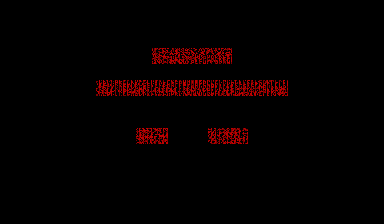
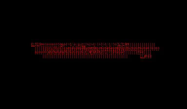

# vb-redalarm

**Static recompilation of Red Alarm (Virtual Boy, 1995)**

A wireframe space combat game — Star Fox meets Battlezone, rendered entirely in glowing red vectors. Red Alarm pushed the Virtual Boy harder than almost any other title, drawing complex 3D environments with nothing but lines.

This project uses [vbrecomp](https://github.com/sp00nznet/vbrecomp) to statically recompile Red Alarm into a native executable.





## Why Red Alarm?

Red Alarm is the second target for vbrecomp after [Mario's Tennis](https://github.com/sp00nznet/vb-mariotennis). It's a great complement because:

- **Wireframe rendering** — uses the VIP differently than sprite/tile-based games, testing vbrecomp's generality
- **No CHR tile swapping** — avoids the block-based rendering issue that plagues Mario's Tennis
- **1MB ROM** — twice the size of Mario's Tennis, stress-tests the V810 recompiler
- **Cool factor** — it's a wireframe space shooter on the Virtual Boy. Come on.

## Current Status

Game boots through logos, loads title screen, and enters the main game loop. Frame buffer is populated with wireframe data (FB:22403 nonzero words). VIP renderer now supports direct frame buffer mode but pixel layout still needs work.

### What's Working

- ROM recompiled: 217 confirmed functions, 58K lines of generated C
- Game boots through T&E Soft/Nintendo logo sequence
- Title screen renders with menu options
- Game view loads — wireframe cockpit/HUD data written to frame buffer
- Frame buffer rendering added to VIP (column-major, 2bpp planar)
- Gamepad input reading (hardware register protocol HLE'd)
- Six frame sync / wait functions identified and HLE'd
- Main game loop runs continuously with per-frame state updates

### What's Not Working Yet

- **Frame buffer pixel layout** — wireframe data is in the frame buffer but the column-major planar pixel extraction produces garbled output. Needs VB hardware format verification.
- **Static scene** — game loop runs but the 3D wireframe scene doesn't animate. The per-frame game update function needs additional state from the interrupt handler's render path.

### HLE'd Functions

| Function | Purpose |
|----------|---------|
| `vb_func_07F20716` | Main frame sync (wait N frames) |
| `vb_func_07F202AE` | Core frame wait + XPCTRL draw start |
| `vb_func_07F20292` | Init frame sync wrapper |
| `vb_func_07F1EB38` | XPSTTS wait (immediate return) |
| `vb_func_07F3C9CE` | Per-frame render init (skip polling) |
| `vb_func_07F3C580` | Main loop wrapper (advance_frame per tick) |

## Building

Requires [vbrecomp](https://github.com/sp00nznet/vbrecomp) as a CMake subdirectory dependency, plus SDL2 and Dear ImGui.

```bash
cmake -B build -G "Visual Studio 17 2022" -DSDL2_DIR=C:/vcpkg/installed/x64-windows/share/sdl2
cmake --build build --config Debug
```

You'll need the original ROM file (`Red Alarm (USA).vb`).

## Project Structure

```
├── src/main.c              # Entry point and game-specific hooks
├── generated/
│   ├── recomp_funcs.c      # 58K lines of recompiled V810 -> C (auto-generated)
│   └── recomp_funcs.h      # Function declarations (217 functions)
├── screenshots/            # Development progress screenshots
├── CMakeLists.txt          # Build configuration
└── build/                  # Build artifacts
```

## License

MIT
